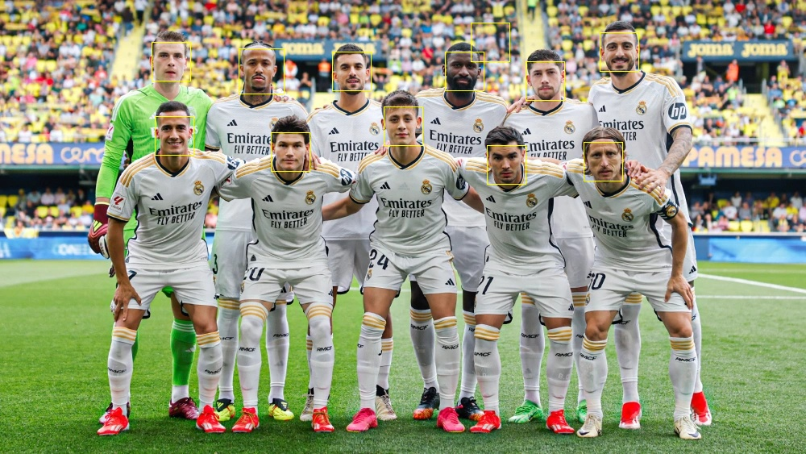

# Haar-based Face Detector

#### [简体中文](./README_zh.md)

### Introduction
This is an implementation of a face detection algorithm based on Haar features, covering the complete workflow from training to prediction.
### Usage
The overall workflow is as follows:  
* **Data Preparation**  
    * Run ```python train_cascade.py --prepare_data``` to automatically download and process the dataset. The positive dataset used is Labeled Faces in the Wild (LFW). It will be saved into `./data/pos_data_normalized.pkl`. The negative dataset should be prepared by the user. Simply place images without faces under `./none_face`, and the processed file will be saved into `./data/negative_list.pkl`.
* **Training**
    1. Specify the basic parameters for each level of the cascade of classifiers. Here are some essential flags:
        * `-s`: stage
        * `--T`: max iteration
        * `--N`: thread number
        * `--min_accuracy`: minimal accuracy
        * `--max_fn_rate`: max false negative rate
        * `--posN`: total number of positive data used for training
        * `--negN`: total number of negative data used for training
        * `--train_val_ratio`: ratio of training data in total data
        * `--view`: a brief preview of the dataset before training
        * For example, you can run ```python train_cascade.py -s1 --T2 --N16 --min_accuracy 0.95 --max_fn_rate 0.05 --posN 20000 --negN 40000 --train_val_ratio 0.8``` to start training the first classifier.
    2. After training, run ```python adjust_threshold.py -s1``` to adjust the threshold for increasing the recall rate. Enter decimal numbers as the scaling factor you want to adjust (e.g., 0.01, 0.1, -0.01). Press Enter to repeat the previous step. Type 'q' or 'quit' to cancel, or 'save' to save the changes.
    3. Repeat the procedure mentioned above until the classifiers meet your desired metrics.
* **Prediction**
    Run ```python predict.py -s 15 -d 2 -p path_of_image``` to apply the prediction procedure on your image. The `-s` flag specifies the total number of stages, and `-d` specifies the downsampling factor.
    * **NOTE**: `predict.py` is not optimized for performance due to the lack of vectorized optimization. It is intended only for visualization purposes. A high performance version of C++ is Here: TODO
### Visualization
* A typical result should look like this:
    
    ^This image shows a classifier with 1000 Haar features.
>>>>>>> dev
